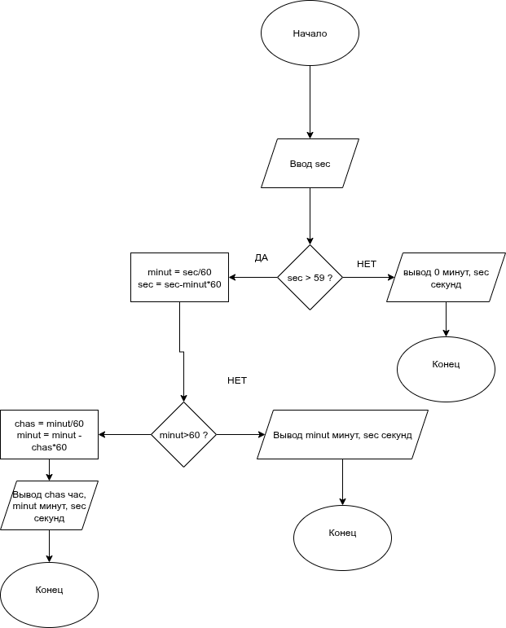

# Домашнее задание к работе 2

## Условие задачи
Написать программу, которая переводит время из секунд в целое значение часов, минут, секунд (если значение часов = 0, то слово час не выводится)
## 1. Алгоритм и блок-схема

### Алгоритм
    1 Начало

    2 Ввести значение sec (количество секунд)

    3 Если sec > 59, то
    3.1. Вычислить minut = sec / 60
    3.2. Найти остаток секунд: sec = sec - minut * 60
    3.3. Если minut > 60, то
        a) Вычислить chas = minut / 60
        b) Найти остаток минут: minut = minut - chas * 60
        c) Вывести chas, minut, sec
    3.4. Иначе (если minut <= 60)
        a) Вывести minut, sec

    4 Иначе (если sec <= 59)
        Вывести "0 минут sec секунд"

    5 Конец

### Блок-схема

*Рис. 1 — Блок-схема алгоритма перевода секунд в часы, минуты и секунды.*
## 2. Реализация программы

    #include <stdio.h>
    #include <stdbool.h>
    int main(){
        int sec;
        int minut,chas;
        printf("Введите кол-во секунд: ");
        scanf("%d", &sec);
        if (sec>59){
            minut = sec/60;
            sec = sec - minut*60;
            if (minut>60){
                chas = minut/60;
                minut = minut - chas*60;
                printf("%d часов %d минут %d секунд\n",chas,minut,sec);
            }
            else printf("%d минут %d секунд\n",minut,sec);
        }
        else printf("0 минут %d секунд\n",sec);
    }

## 3. Результаты работы программы

    Введите кол-во секунд: 3456
    57 минут 36 секунд

## 4. Информация о разработчике

[Андреев Артём бТИИ-251]
